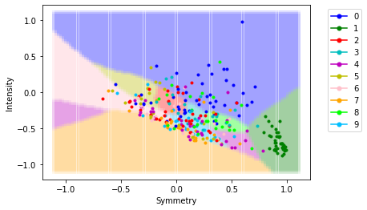

# digit-classification
Classifying handwritten digits data (0-9) using various machine learning techniques.

The code in this repository uses PyTorch neural networks for classification.  Check out this repository (https://github.com/rsilen18/digits-ML-from-data) for implementations of linear regression, kNN, RBF, neural networks, and SVMs from scratch using the same data (this code is private becuase it was used for assignments in my ML course). 
